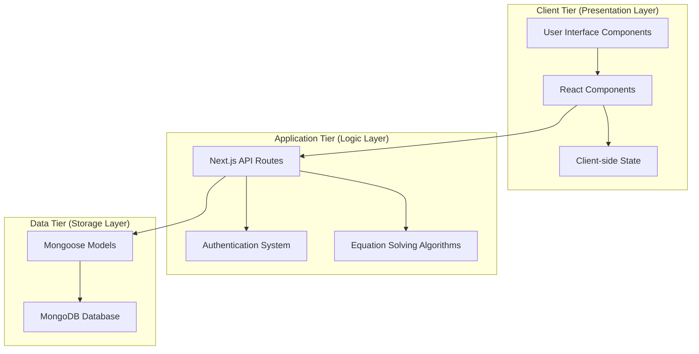
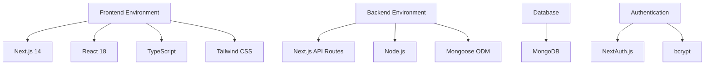
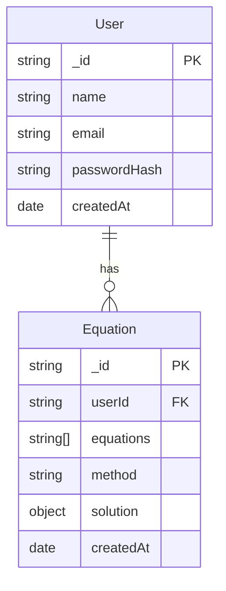
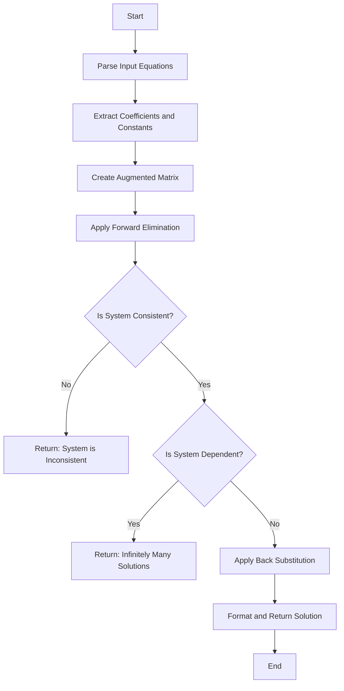
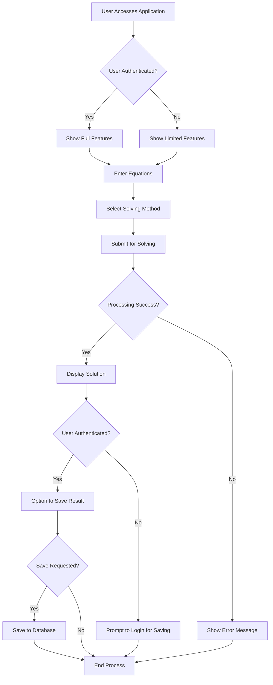
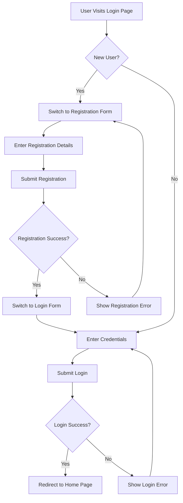
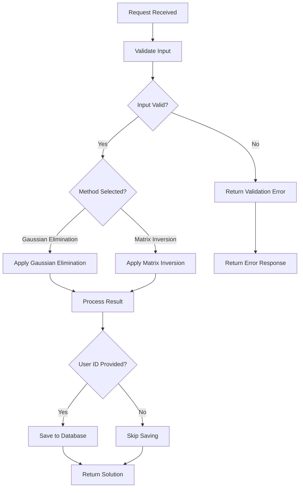

# CHAPTER FOUR: SYSTEM DESIGN AND IMPLEMENTATION

## 4.1 Objective of Design

The primary objective of designing the Linear Equation Solver System is to create a user-friendly web application that enables users to:

1. Input and solve systems of linear equations using established mathematical algorithms
2. Visualize the solutions in a clear and understandable format
3. Save their equation history for future reference
4. Access the system across various devices through a responsive web interface

The design prioritizes usability, accuracy, and security while maintaining a clean and intuitive user experience.

## 4.2 System Architecture in Terms of Tiers

The Linear Equation Solver System implements a three-tier architecture:

1. **Client Tier (Presentation Layer)**
   - Next.js front-end components (React)
   - Client-side state management
   - User interface elements (forms, buttons, displays)

2. **Application Tier (Logic Layer)**
   - Next.js API routes for server-side processing
   - Authentication and authorization services
   - Core equation solving algorithms
   - Data validation and error handling

3. **Data Tier (Storage Layer)**
   - MongoDB database for persistent storage
   - Mongoose ODM for data modeling and database interactions
   - Secure storage of user credentials and equation history

## 4.3 Choice of Programming Environment

The system utilizes modern web technologies to ensure performance, maintainability, and security:

**Frontend:**
- **Next.js 14**: Provides server-side rendering, routing, and API routes
- **React 18**: Component-based UI development with hooks
- **TypeScript**: Static typing for improved developer experience and code quality
- **Tailwind CSS**: Utility-first CSS framework for responsive design

**Backend:**
- **Next.js API Routes**: Serverless API endpoints
- **Node.js**: JavaScript runtime environment
- **Mongoose**: MongoDB object modeling tool

**Database:**
- **MongoDB**: NoSQL database for flexible schema development and scalability

**Authentication:**
- **NextAuth.js**: Authentication framework for Next.js
- **bcrypt**: Password hashing library

## 4.4 Database Structure

The database structure consists of two primary collections that form the core of our data model:

This structure facilitates user account management and the storage of equation solving history.

## 4.5 Database Table Definition

The MongoDB collections are defined using Mongoose schemas:

**User Collection:**

| Field | Type | Description | Constraints |
|-------|------|-------------|------------|
| _id | ObjectId | MongoDB document identifier | Primary key, auto-generated |
| name | String | User's name | Required |
| email | String | User's email address | Required, Unique |
| passwordHash | String | Hashed user password | Required |
| createdAt | Date | Account creation timestamp | Default: current date |

**Equation Collection:**

| Field | Type | Description | Constraints |
|-------|------|-------------|------------|
| _id | ObjectId | MongoDB document identifier | Primary key, auto-generated |
| userId | ObjectId | Reference to User | Foreign key |
| equations | Array of String | Input equations | Required |
| method | String | Solving method used | Required, Enum: ["Gaussian Elimination", "Matrix Inversion"] |
| solution | Object | Solution variables | Required |
| createdAt | Date | Equation creation timestamp | Default: current date |

## 4.6 Input and Output Screen Format

### Input Screen (Home Page)
The main input screen allows users to enter a variable number of linear equations and select a solving method.

Key features:
- Dropdown to select number of equations (2-6)
- Input fields for each equation
- Method selection (Gaussian Elimination or Matrix Inversion)
- Solve button to process the system
- Example equations for user guidance

### Output Screen (Solution Display)
The solution display shows:
- Original system of equations
- Method used for solving
- Solution status (solved, inconsistent, dependent)
- Variable values if solution exists
- Option to save the result (for authenticated users)

## 4.7 Program Algorithm

The core algorithm for solving linear equations uses Gaussian Elimination:

The algorithm processes as follows:

1. **Parse the input equations** to identify variables and coefficients
2. **Create an augmented matrix** [A|b] where A is the coefficient matrix and b is the constant vector
3. **Forward elimination**: Transform the matrix to row echelon form
4. **Check for consistency**: If a row has all zeros but a non-zero constant, the system is inconsistent
5. **Check for dependency**: If there are fewer pivot rows than variables, the system has infinitely many solutions
6. **Back substitution**: Solve for each variable starting from the bottom row
7. **Return the solution** as a mapping of variables to their values

## 4.8 Program Flowcharts

### Main Application Flow

### Authentication Flow

### Equation Solving Process

## 4.9 Hardware Requirements

The system has been designed to run efficiently on a wide range of hardware configurations:

**Server Requirements:**
- Modern server with 2+ CPU cores
- Minimum 2GB RAM (4GB recommended)
- At least 1GB free storage space
- Active internet connection

**Client Requirements:**
- Any modern device with a web browser (desktop, laptop, tablet, or smartphone)
- Minimum screen resolution of 320px width (responsive design accommodates various screen sizes)
- Active internet connection

## 4.10 Software Requirements

**Server Environment:**
- Node.js (v18.0.0 or later)
- npm (v9.0.0 or later)
- MongoDB (v5.0 or later)

**Development Tools:**
- Visual Studio Code or similar code editor
- Git for version control
- Next.js and React development tools

**Client Requirements:**
- Modern web browser (Chrome, Firefox, Safari, Edge)
- JavaScript enabled
- Cookies enabled for authentication

## 4.11 Documentation

The system includes comprehensive documentation to support development, deployment, and usage:

1. **README.md**: Overview, features, and installation instructions
2. **DEPLOYMENT.md**: Detailed deployment guide for production environments
3. **Code Comments**: Inline documentation within the codebase
4. **Type Definitions**: TypeScript interfaces and types documenting data structures
5. **Environment Setup Guide**: Instructions for configuring environment variables
6. **API Documentation**: Endpoints and expected request/response formats

# CHAPTER FIVE: SUMMARY, CONCLUSION AND RECOMMENDATION

## 5.1 Summary

The Linear Equation Solver System is a web-based application built with Next.js and MongoDB that enables users to solve systems of linear equations using mathematical algorithms. The system provides an intuitive user interface for entering equations, displays solutions clearly, and allows authenticated users to save their equation history.

Key features implemented include:

1. **Equation Input Interface**: A flexible form allowing users to input varying numbers of linear equations
2. **Multiple Solving Methods**: Support for Gaussian Elimination and Matrix Inversion algorithms
3. **User Authentication**: Secure login and registration system using NextAuth.js
4. **History Management**: Ability for users to save and view their equation solving history
5. **Responsive Design**: Mobile-friendly interface that works across devices

The application demonstrates the practical application of modern web development technologies to solve mathematical problems efficiently while providing a seamless user experience.

## 5.2 Conclusion

The Linear Equation Solver System successfully meets its objectives of providing an accessible and user-friendly platform for solving systems of linear equations. By leveraging the power of Next.js, React, and MongoDB, the system delivers:

1. **Performance**: Fast calculation and rendering of equation solutions
2. **Usability**: Intuitive interface suitable for users of varying technical backgrounds
3. **Reliability**: Accurate solutions using established mathematical algorithms
4. **Security**: Protected user accounts and data with modern authentication practices
5. **Maintainability**: Clean code structure and comprehensive documentation for future development

This project demonstrates how modern web technologies can be effectively applied to create practical educational tools that make complex mathematical concepts more accessible.

## 5.3 Recommendation

Based on the development experience and current functionality, the following recommendations are suggested for future enhancements:

1. **Additional Solving Methods**: Implement more solution techniques such as LU Decomposition, Cramer's Rule, and Jacobi's Method
2. **Step-by-Step Solutions**: Add functionality to show the solving process step-by-step for educational purposes
3. **Matrix Editor**: Provide a visual matrix input interface as an alternative to equation entry
4. **Equation Parser Improvements**: Enhance the equation parser to support more formats and notations
5. **Result Visualization**: Add graphical representation of solutions for 2D and 3D systems
6. **Performance Optimization**: Implement worker threads for solving large equation systems
7. **Offline Support**: Add Progressive Web App (PWA) capabilities for offline usage
8. **Collaborative Features**: Enable sharing of equation systems and solutions between users
9. **Mobile Application**: Develop native mobile applications using React Native to expand platform support
10. **Integration with LMS**: Create plugins for Learning Management Systems like Moodle or Canvas

These enhancements would further strengthen the application's utility as both an educational tool and a practical utility for students, educators, and professionals working with linear equations.
